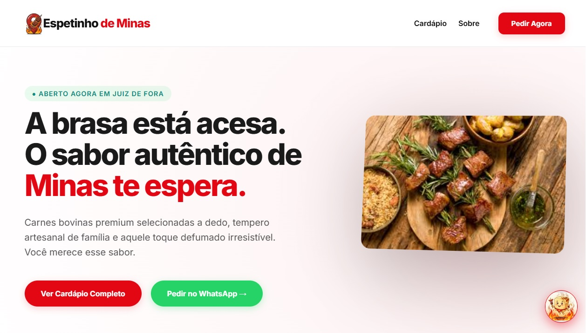
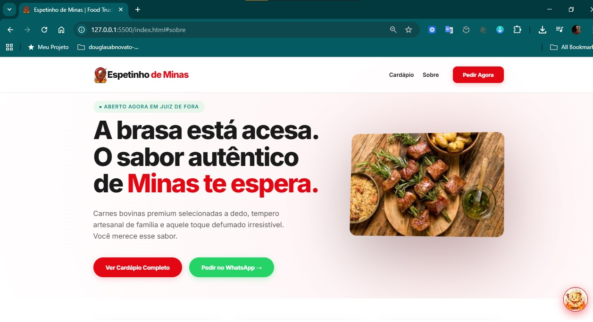
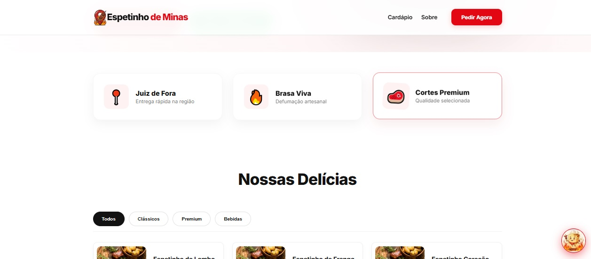
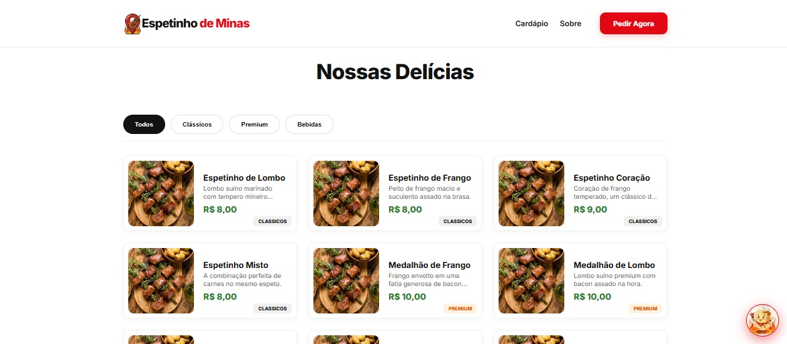
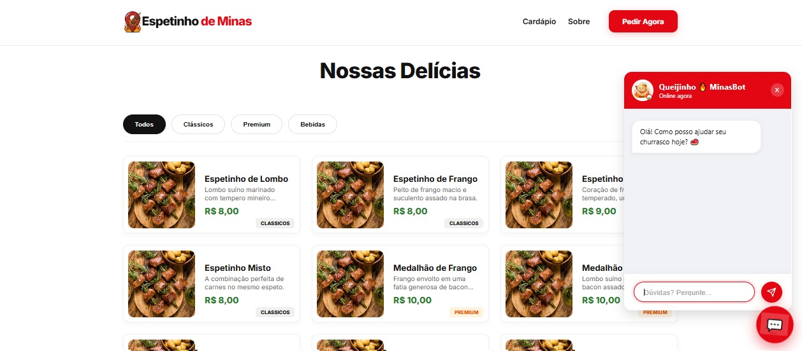
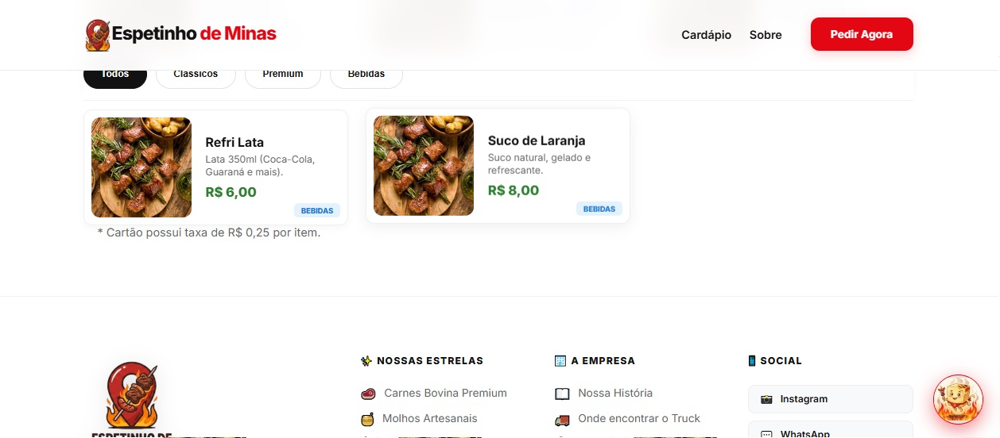
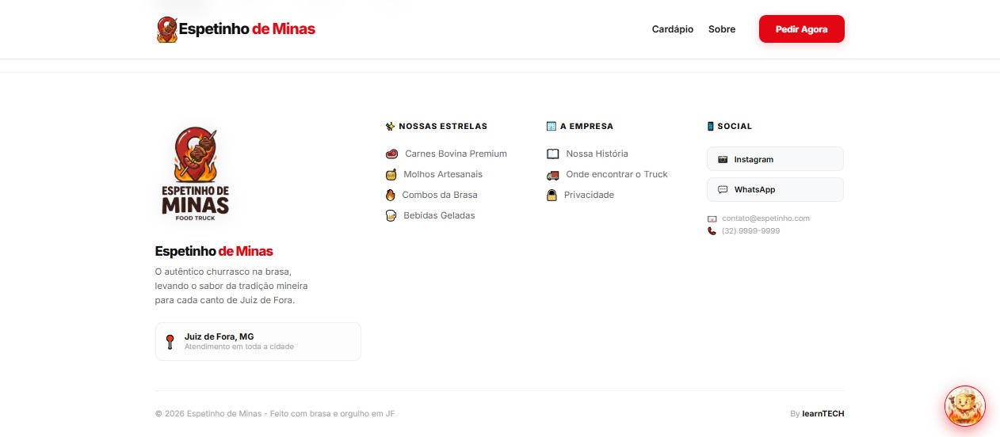

# 🥩 Espetinho de Minas

 Um projeto focado em demonstrar a experiência digital de um **Food Truck** de espetinhos premium, unindo tradição mineira e tecnologia de ponta.
 

   

## 📸 Demonstração Visual

Abaixo, algumas capturas de tela da interface do **MinasBot** e da vitrine digital em funcionamento:

### 📱 Mobile & Desktop

   
   
   
   
   
   
   

---

### 💬 Fluxo do MinasBot (O Queijinho)

Aqui você pode ver a evolução da interface e o atendimento humanizado:

|                        Header e Status                         |                      Interface de Chat                      |                        Mascote no Botão                        |
| :------------------------------------------------------------: | :---------------------------------------------------------: | :------------------------------------------------------------: |
|  |  |  |
|                  _Status Online e Identidade_                  |                    _Simulação de Pedido_                    |                    _Interação com Mascote_                     |

---

## 🚀 Projeto

O **Espetinho de Minas** é um MVP desenvolvido para validar uma vitrine digital de alta performance para o setor de alimentação em Juiz de Fora, MG.

### 🛠 Tecnologia

O desenvolvimento segue a filosofia de código limpo e carregamento rápido (Zero Framework Dependency):

- [x] **HTML5 & CSS3**: Estrutura semântica e design responsivo.
- [x] **Vanilla JavaScript**: Lógica de renderização e sistema de chat sem bibliotecas externas.
- [x] **JSON Database**: Gerenciamento de cardápio via arquivo estático para máxima velocidade.

### ✨ Funcionalidades

- [x] **Vitrine Dinâmica**: Renderização automática de produtos a partir do `data.json`.
- [x] **Filtros de Categoria**: Navegação fluida entre Carnes, Combos e Bebidas.
- [x] **MinasBot (Queijinho)**: Chat interativo com inteligência local para simulação de pedidos.
- [x] **UX Otimizada**: Interface inspirada em apps de delivery (iFood Style).

### 📂 Seções do Site

- **Header**: Branding e navegação rápida.
- **Hero**: Destaque visual do churrasco na brasa.
- **Menu Tabs**: Filtros de navegação por categoria.
- **Product Grid**: Vitrine de espetinhos com badges e preços.
- **Chat System**: Interface de atendimento humanizado com o mascote.

---

## 🎨 Design

#### Inspirações

O design foi concebido para transmitir a hospitalidade mineira com a agilidade de um Food Truck moderno, integrando-se ao ecossistema **learnTECH**.

#### Cores

- **Primária**: `#e30613` (Vermelho Brasa) - Estimula o apetite e destaca a marca.
- **Secundária**: `#000000` (Preto) - Elegância e contraste premium.
- **Fundo**: `#f9f9f9` (Cinza Claro) - Foco na legibilidade.

#### Fontes

- **Montserrat / Roboto**: Tipografia moderna e altamente legível em dispositivos móveis.

---

> **Status do Projeto**: MVP Finalizado para demonstração técnica. 🚀
> Desenvolvido por **Douglas Novato** - Juiz de Fora, MG.
